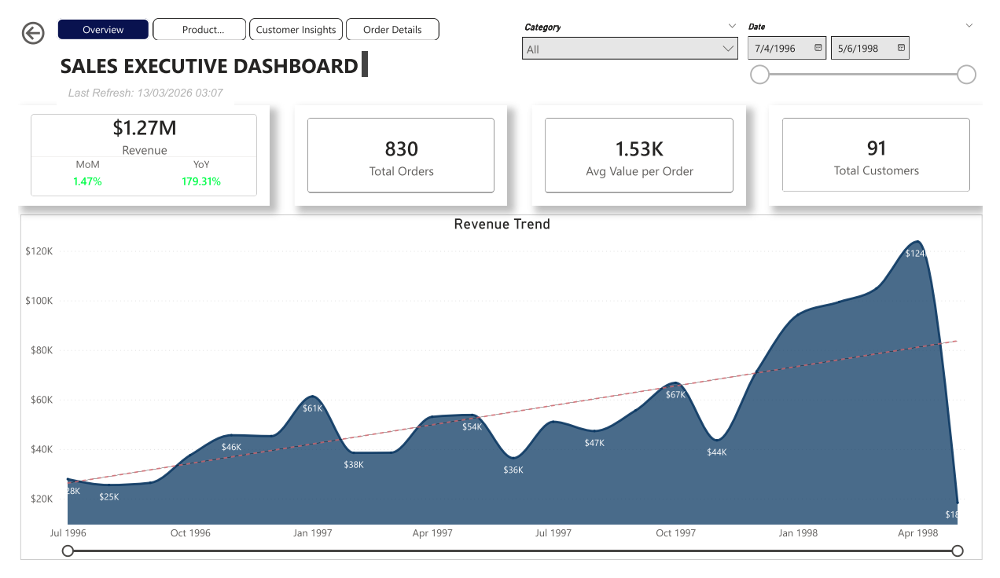
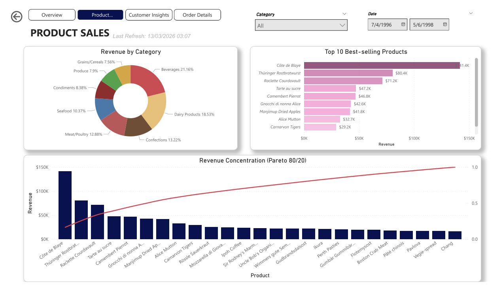
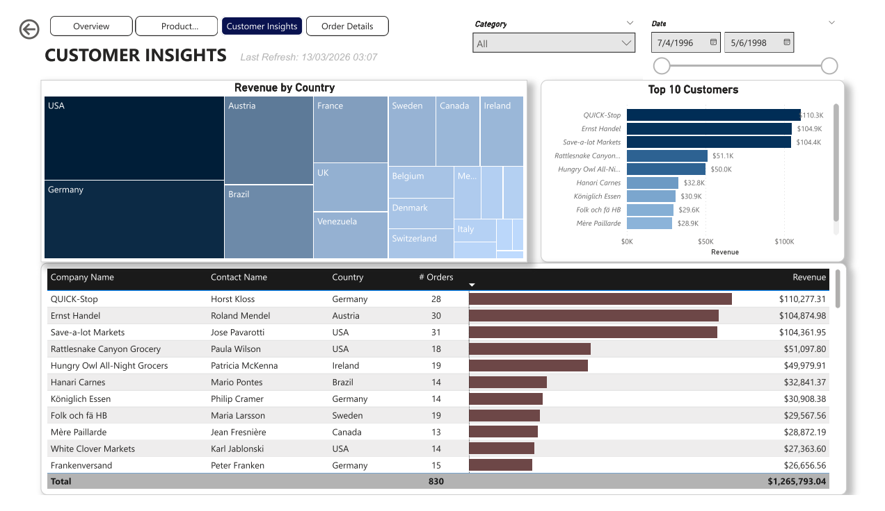
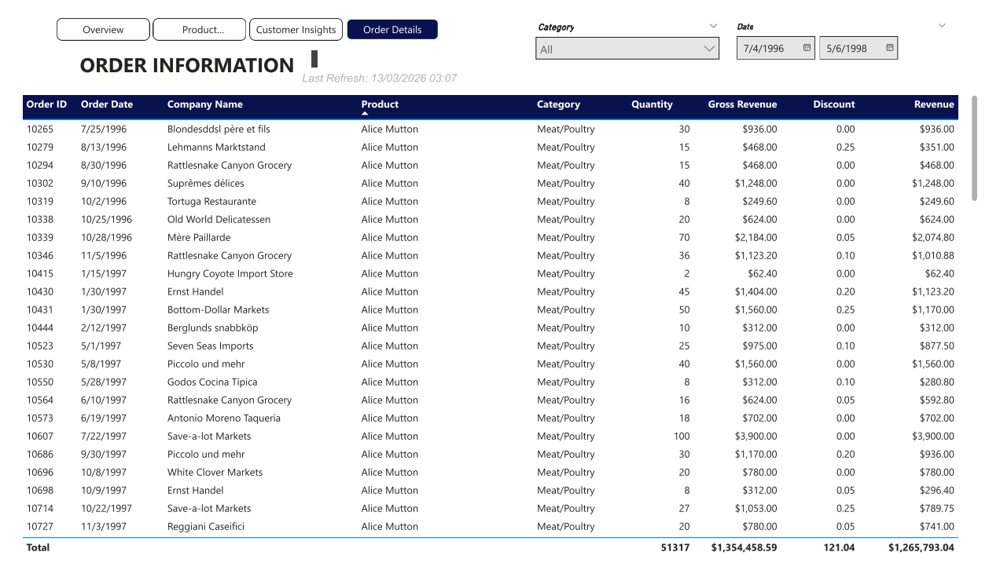

# SQL Sales Analysis Case Study

## 📌 Objective
Analyze sales data to understand customer behavior and product performance.

## 📊 Dataset
Sample transactional dataset including:
- Orders
- Customers
- Products
- Categories

## 🔍 Key Analysis

- Top customers by number of orders  
- Revenue contribution by product  
- Revenue by product category  
- Best-selling products within each category  

## ⚙️ Approach

- Joined multiple tables to create an analysis-ready dataset  
- Used SQL for data aggregation and transformation  
- Applied window functions (ROW_NUMBER, RANK) for ranking and segmentation  
- Calculated key metrics such as revenue and contribution percentage  

## 🛠 Tools Used

- SQL (JOIN, GROUP BY, Window Functions)  
- Power BI (for data visualization)

## 📈 Output

- Structured dataset for analysis  
- SQL queries for business insights  
- Dashboard (Power BI) to visualize performance trends  

## 📊 Dashboard Preview

---

## 🚀 Notes
This project was completed as part of a technical assessment to solve practical business-oriented data problems.
